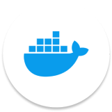

<br>
<div align="center">
    <div >
        
    </div>
    <div>
            <h3><b>TerraFarm</b></h3>
            <p><i>Cultivating Smarter, Growing Stronger.</i></p>
    </div>      
</div>
<br>
<h1 align="center">TerraFarm Backend Website</h1>
<div align="center">


</div>
<br>
<i>The engine behind tailored insights</i>: TTerraFarm's backend ensures smooth, reliable performance by processing vast amounts of Earth observation and predictive data. It manages user profiles, real-time alerts, and resource management tools while supporting offline-first capabilities, ensuring farmers can access vital information and take action no matter where they are.

## 👨🏻‍💻 &nbsp;Technology Stack

<div align="center">
<a href="https://react.dev/">
<kbd>

</kbd>
</a>

<a href="https://www.typescriptlang.org/">
<kbd>

</kbd>
</a>

<a href="https://tailwindcss.com/">
<kbd>

</kbd>
</a>

<a href="https://ui.shadcn.com/">
<kbd>

</kbd>
</a>

<a href="https://ui.shadcn.com/">
<kbd>

</kbd>
</a>

<a href="https://ui.shadcn.com/">
<kbd>

</kbd>
</a>
</div>
<div align="center">
<h4>Express | NodeJS | Supabase | Meteometic | Google Cloud Platform | Docker</h4>
</div>
<br>

## ⚙️ &nbsp;How to Run
1. **Clone the repository** from the terminal using the following command:
    ```bash
    $ git clone https://github.com/TerraFarm-TaniMakmur88/TerraFarm_Backend.git
    ```

2. **Create a `.env` file** inside the repository directory using the `env.example` file as the template. You should add information about your own Google project to the `.env` file.

3. **Run the server** using the following command. Make sure you have Docker Desktop installed on your device:
    ```bash
    npm run start
    ```

4. The TerraFarm backend server should now be running. You can check the server by opening [http://localhost:8080](http://localhost:8080) in your web browser.


## 🔑 &nbsp;List of Endpoints
| Endpoint                            |  Method  |   Usage                                                                                  |
| ----------------------------------- | :------: | ---------------------------------------------------------------------------------------- |
| /api/field                          | GET      | Users can retrieve field information based on their user profile                      |
| /api/field/status                   | GET      | Users can retrieve field information along with their status                          |
| /api/field/:id                     | GET      | Users can retrieve specific information about a field using its ID                    |
| /api/field                          | POST     | Users can create new fields                                                           |
| /api/field                          | PUT      | Users can update existing field data                                                  |
| /api/field/status                   | PUT      | Users can update the status of a field                                               |
| /api/field/plant_date              | PUT      | Users can update the planting date of a field                                        |
| /api/field                          | DELETE   | Users can delete a field based on its ID                                             |
| /api/user                           | GET      | Users can retrieve their own user information                                         |
| /api/user                           | POST     | Users can create a new user account                                                  |
| /api/user/login                     | POST     | Users can log in to their accounts                                                    |
| /api/forecast/temperature           | GET      | Users can retrieve temperature forecasts                                              |
| /api/forecast/windspeed             | GET      | Users can retrieve wind speed forecasts                                              |
| /api/forecast/humidity              | GET      | Users can retrieve humidity forecasts                                                 |
| /api/forecast/rainfall              | GET      | Users can retrieve rainfall forecasts                                                |
| /api/weather                        | GET      | Users can get the current weather information                                         |
| /api/weather/date                   | GET      | Users can get weather information for a specific date                                |
| /api/weather/date_range             | GET      | Users can get weather information for a date range                                   |
| /api/weather/dashboard               | GET      | Users can retrieve weather data for the dashboard                                    |
| /api/calculator/calculate           | POST     | Users can calculate profit based on provided data                                     |

## 👥 &nbsp;Contributors
| <div align="center"><a href="https://github.com/mikeleo03"></a></div> | <div align="center"><a href="https://github.com/arleenchr"></a></div> | <div align="center"><a href="https://github.com/AustinPardosi"></a></div> |
| ---------------------------------------------------------------------------------------------------------------------------------------------------------------------------------------------------------------------------------- | ----------------------------------------------------------------------------------------------------------------------------------------------------------------------------------------------------------------------------------- | ----------------------------------------------------------------------------------------------------------------------------------------------------------------------------------------------------------------------------- |
| <div align="center"><h3><b><a href="https://github.com/mikeleo03">Michael Leon Putra Widhi</a></b></h3><i><p>Bandung Institute of Technology</i></p></div>                                                                                        | <div align="center"><h3><b><a href="https://github.com/arleenchr">Arleen Chrysantha Gunardi</a></b></h3></a><p><i>Bandung Institute of Technology</i></p></div>                                                               | <div align="center"><h3><b><a href="https://github.com/AustinPardosi">Austin Gabriel Pardosi</a></b></h3></a><p><i>Bandung Institute of Technology</i></p></div>                                                                            
| <div align="center"><a href="https://github.com/Nat10k"></a></div> | <div align="center"><a href="https://github.com/manuellaiv"></a></div> | <div align="center"><a href="https://github.com/Mehmed13"></a></div> |
| <div align="center"><h3><b><a href="https://github.com/Nat10k">Nathan Tenka</a></b></h3><i><p>Bandung Institute of Technology</i></p></div>                                                                                        | <div align="center"><h3><b><a href="https://github.com/manuellaiv">Manuella Ivana Uli Sianipar</a></b></h3></a><p><i>Bandung Institute of Technology</i></p></div>                                                               | <div align="center"><h3><b><a href="https://github.com/Mehmed13">Muhammad Fadhil Amri</a></b></h3></a><p><i>Bandung Institute of Technology</i></p></div>                                                                            |